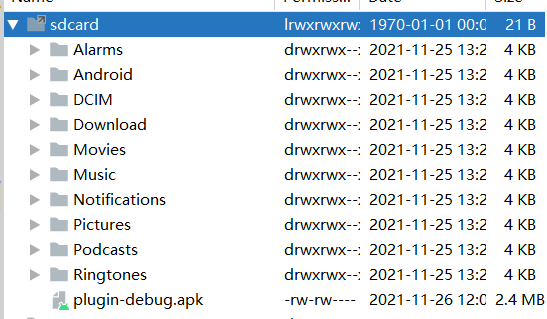

# 1. 功能

加载外部`apk`文件中的`Activity`，包括`Java`文件和资源文件案例。

对应博客链接：

- [Android插件化开发指南——Hook技术（一）【长文】_梦否-CSDN博客](https://blog.csdn.net/qq_26460841/article/details/121497914)
- [Android插件化开发指南——Hook技术（二）_梦否-CSDN博客](https://blog.csdn.net/qq_26460841/article/details/121568093)

# 2. 使用说明

将`plugin-debug.apk`放置到模拟器的`SD`卡，如下图所示：

<p align="center">
	
</p>

其中`plugin-debug.apk`为项目`MyApplication`中的`plugin`模块编译出来的文件，当然你也可以自定义一个`apk`文件。

在`BaseApplication`以及`BaseActivity`已经完成了将插件的引入过程，所以可以直接在`app`的任意一个继承自`BaseActivity`的`Activity`中使用。比如案例中的：

```java
public class MainActivity extends BaseActivity {

    @Override
    protected void onCreate(Bundle savedInstanceState) {
        super.onCreate(savedInstanceState);
        setContentView(R.layout.activity_main);
    }

    // onClick
    public void jump(View view){
        try {
            Class<?> aClass = getClassLoader().loadClass("com.weizu.plugin.MainActivity");
            Log.e("TAG", "onCreate: " + aClass.getName());
            Intent intent = new Intent(MainActivity.this, aClass);
            startActivity(intent);
        } catch (Exception e) {
            e.printStackTrace();
        }

        String string = getString(R.string.app_name);
    }
}
```

结果确实也跳转到了`plugin-debug.apk`中的`MainActivity`中：

<p align="center">
	
</p>

#  3. 注释：

注意需要开启访问外部`SD`卡的权限。
